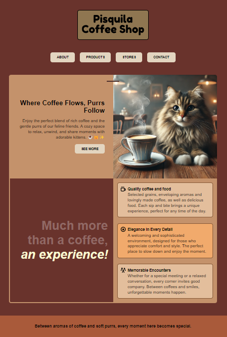

# ☕ Piscuilla Coffee Shop- Café Website  

This project represents the creation of a **simple café website**, developed as part of my **learning and skill enhancement process** in **HTML and CSS**.  
The goal is to explore **semantic structures, advanced styling, and responsive layout techniques**, applying concepts studied through exercises and design challenges.  

## 🚀 Technologies Used  
- **HTML5** → Structure and content organization.  
- **CSS3** → Styling, visual effects, and responsiveness. 

## 🖼️ Final Mini-Project Image
Below is an image of the finalized mini-project, showcasing the layout and design implemented throughout the development process:
 
 
